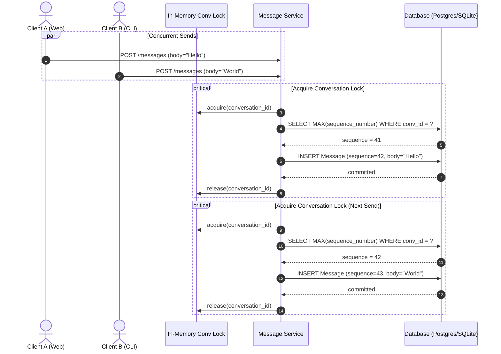

# Relationship OS - System Architecture Specification

## 1. Monorepo Organization

Relationship OS follows an enterprise monorepo layout separating application runtimes, shared domain logic, outbound integration adapters, testing matrices, and operational tooling.

```
relationship-os/
├── apps/
│   ├── api/                      # Core FastAPI Backend & Async Outbox Worker
│   │   ├── alembic/              # Database migration definitions
│   │   └── src/
│   │       ├── core/             # Configuration, Database engine, Security, Middlewares
│   │       ├── models/           # SQLAlchemy Declarative Models (10 tables)
│   │       ├── routers/          # REST & WebSocket API endpoints
│   │       └── services/         # Domain services (Auth, Message, Outbox, Presence, Storage)
│   ├── web/                      # Production React 18 SPA (Vite + Tailwind CSS + Lucide)
│   │   ├── src/
│   │   │   ├── components/       # Chat window, MessageList, InputBar, SettingsModal
│   │   │   ├── hooks/            # useWebSocket, useAuth, useMessages
│   │   │   └── services/         # Axios API client, WebSocket gateway
│   │   └── dist/                 # Compiled, optimized production frontend bundle
│   ├── cli/                      # Rich TUI Terminal Client
│   │   └── src/
│   │       ├── cli.py            # Rich Layout, Live terminal dashboard, Input loop
│   │       └── storage.py        # Local session token & cached history (0600 permissions)
│   └── launcher/                 # Safe Zero-Piping Client Launchers
│       ├── Launch-RelationshipOS.ps1  # Windows PowerShell 5.1+ / PowerShell 7+ launcher
│       └── launch.sh                  # POSIX-compliant Bash launcher for Linux & macOS
├── packages/
│   ├── shared/                   # Core shared libraries across all layers
│   │   └── src/
│   │       ├── constants.py      # System enums (UserRole, DeliveryState, EventType)
│   │       ├── crypto.py         # Bcrypt, HMAC-SHA256 signing, Anti-replay, Token entropy
│   │       ├── models.py         # Canonical Pydantic schemas (events, payloads)
│   │       ├── ssrf.py           # SSRF validation matrix & CIDR blacklists
│   │       └── utils.py          # UTC normalization, timestamp parsing
│   ├── schema/                   # Shared JSON schemas & validation specs
│   └── sdk/                      # Client SDKs (Python, TypeScript)
├── integrations/                 # Pluggable Owner Integration Adapters
│   ├── base.py                   # IntegrationAdapter Abstract Base Class
│   ├── discord/                  # Discord Webhook/Bot adapter with mention redaction
│   ├── webhook/                  # Generic HMAC-SHA256 signing webhook adapter
│   └── signal/                   # Signal REST client adapter (extensible stub)
├── tests/                        # 100% Automated Multi-Tier Test Suite
│   ├── unit/                     # Crypto, SSRF, Rate Limiting, Models
│   ├── integration/              # API Auth, Chat, WebSockets, Outbox, Adapters, Attachments
│   ├── security/                 # Headers, IDOR, SSRF matrices, Anti-replay, Entropy
│   ├── load/                     # Monotonic concurrency & Idempotency deduplication races
│   └── e2e/                      # 12-step full acceptance lifecycle test
├── scripts/                      # Operational & Developer Automation
│   ├── dev/                      # Local dev runner (dev-start.sh)
│   ├── test/                     # Master test suite runner (run-all-tests.sh)
│   ├── deploy/                   # Docker Compose orchestrator (deploy.sh)
│   ├── seed.py                   # Initial database seeder
│   └── verify_integrity.py       # Static & dynamic system verification suite
├── Dockerfile.api                # Multi-stage Python 3.13 ASGI production build
├── Dockerfile.web                # Node 20 build + Nginx Alpine static server
├── docker-compose.yml            # Multi-service container orchestration
└── nginx.conf                    # Reverse proxy with WebSocket upgrade & strict CSP
```

---

## 2. Core Architectural Patterns

### 2.1 Monotonic Sequence Ordering Guarantees

In real-time messaging, relying on client timestamps or network arrival order results in out-of-order rendering, race conditions, and synchronization confusion. Relationship OS enforces **strict per-conversation monotonic sequence ordering**:

1. **Deterministic Monotonic Allocation:**
   - Every message sent within a conversation is assigned an incremental integer sequence number: `1, 2, 3, 4, ...`
   - Gaps are mathematically impossible.
2. **Concurrency Control:**
   - Write operations acquire an in-memory asynchronous lock keyed by `conversation_id`: `_get_conv_lock(conversation_id)`.
   - The lock wraps the `SELECT COALESCE(MAX(sequence_number), 0) + 1` query and the insertion.
   - At the database level, a composite unique constraint `uq_message_conversation_sequence UNIQUE (conversation_id, sequence_number)` provides absolute data integrity.
   - In the event of distributed race attempts, an `IntegrityError` triggers a rollback, deduplication check, and retry.
3. **Deterministic Sync & Replay:**
   - When a client reconnects, it supplies `after_sequence` (the last sequence number it received).
   - The server streams all messages strictly matching `sequence_number > after_sequence` ordered by `sequence_number ASC`.



---

### 2.2 Transactional Outbox Pattern

To guarantee that recipient messages are reliably routed to external owner channels (Discord, Webhooks) without distributed transaction anomalies, Relationship OS implements the **Transactional Outbox Pattern**:

1. **Atomic Dual-Write:**
   - When `MessageService.send_message` executes, it inserts the `Message`, the associated `MessageDelivery` tracking records, and the `OutboxEvent` into the database inside the **exact same database transaction**.
   - If the database commit succeeds, both the message and the pending dispatch are guaranteed to be persisted. If it fails, neither is persisted.
2. **Asynchronous Polling Worker (`OutboxWorker`):**
   - A dedicated background task polls the database for `outbox_events` with `status = 'pending'`.
   - The worker claims records, passes them to the `IntegrationRouter`, and dispatches to configured adapters.
3. **Exponential Backoff with Jitter:**
   - When an external endpoint fails (e.g. Discord 503 or webhook timeout), the worker increments `retry_count`, calculates backoff:
     $$\Delta t = \min(60, 2^{\text{retry\_count}} \pm \text{jitter})$$
   - Updates `next_retry_at` and sets status back to `pending`.
4. **Dead-Letter Queue:**
   - If `retry_count >= OUTBOX_MAX_RETRIES` (default 5), the event is marked `dead_letter` and the `MessageDelivery` is marked `failed`.
   - The administrator can inspect failed deliveries via `GET /api/v1/admin/deliveries/failed` and re-queue them via `POST /api/v1/admin/deliveries/{id}/retry`.

```mermaid
flowchart LR
    subgraph Transaction["Atomic Database Transaction"]
        M["INSERT Message"]
        D["INSERT MessageDelivery"]
        O["INSERT OutboxEvent (pending)"]
        M --- D --- O
    end

    subgraph Worker["Outbox Worker Daemon"]
        POLL["Poll pending events"]
        ROUTER["Integration Router"]
        RETRY["Backoff & Jitter"]
        DLQ["Dead Letter Queue"]
    end

    subgraph Channels["External Channels"]
        DISCORD["Discord API"]
        WEBHOOK["HMAC Webhook Endpoint"]
    end

    Transaction -->|Committed| POLL
    POLL --> ROUTER
    ROUTER -->|Send| Channels
    Channels -. Success .->|Update Status: delivered| Transaction
    Channels -. Failure .-> RETRY
    RETRY -->|Max Retries Exceeded| DLQ
```

---

### 2.3 Real-Time WebSocket Gateway Protocol

The WebSocket hub (`/ws/chat/{conversation_id}`) provides bi-directional, full-duplex messaging with built-in connection resilience:

- **Handshake Authentication:**
  - Clients authenticate via query parameter `?token=<jwt>` during upgrade.
  - The server verifies session validity, user active status, and conversation membership before accepting the connection.
- **Message Framing (JSON Format):**
  - **Ping/Pong:** `{ "type": "ping" }` $\leftrightarrow$ `{ "type": "pong" }`
  - **Typing Indicator:** `{ "type": "typing", "conversation_id": "...", "is_typing": true }`
  - **Sequence Replay:** `{ "type": "sync", "after_sequence": 14 }` triggers an immediate chronological stream of missing messages.
  - **Send Message:** `{ "type": "send", "client_message_id": "...", "body": "..." }`
  - **Event Broadcast:** Server broadcasts `{ "type": "event", "event_type": "message.created", "payload": { ... } }` to all connected clients in the room.

---

### 2.4 Bidirectional Integration Routing

1. **Outbound Dispatch (Recipient $\rightarrow$ Owner):**
   - Recipient sends message via Web or Terminal client.
   - Outbox worker routes message to configured adapters.
   - Discord adapter formats an embedded card, sanitizes mentions (`@everyone`, `@here`, `<@...>`), and dispatches to the Owner's private Discord channel.
   - Webhook adapter signs the JSON payload with HMAC-SHA256 and sends it with a timestamp header to the configured URL.
2. **Inbound Ingestion (Owner $\rightarrow$ Recipient):**
   - Owner replies via Discord webhook bot or authenticated HTTP callback to `/api/v1/webhooks/inbound`.
   - The inbound handler validates the cryptographic HMAC signature and anti-replay timestamp.
   - It checks `client_message_id` and metadata origin to prevent reflection loops.
   - It records the message inside the canonical conversation room, updates monotonic sequence numbers, and immediately pushes it over the live WebSocket hub to the Recipient's web and terminal clients.

---

## 3. Storage and File Attachment Architecture

Relationship OS supports encrypted media and file attachment uploads:

1. **Pre-flight Validation:**
   - File extensions are validated against an explicit whitelist (`.jpg`, `.jpeg`, `.png`, `.gif`, `.webp`, `.pdf`, `.txt`, `.csv`, `.docx`).
   - Executable extensions (`.exe`, `.dll`, `.bat`, `.ps1`, `.sh`, `.elf`, `.msi`) are rejected with `400 Bad Request`.
   - File size is clamped to `STORAGE_MAX_FILE_SIZE_BYTES` (default 25 MB).
2. **Path Traversal Defense:**
   - Stored files are assigned random UUID filenames (`{uuid}.{ext}`).
   - The original filename is sanitized and stored separately in metadata.
   - File retrieval uses strict boundary checking to verify the requested path resides within `STORAGE_LOCAL_PATH`.
