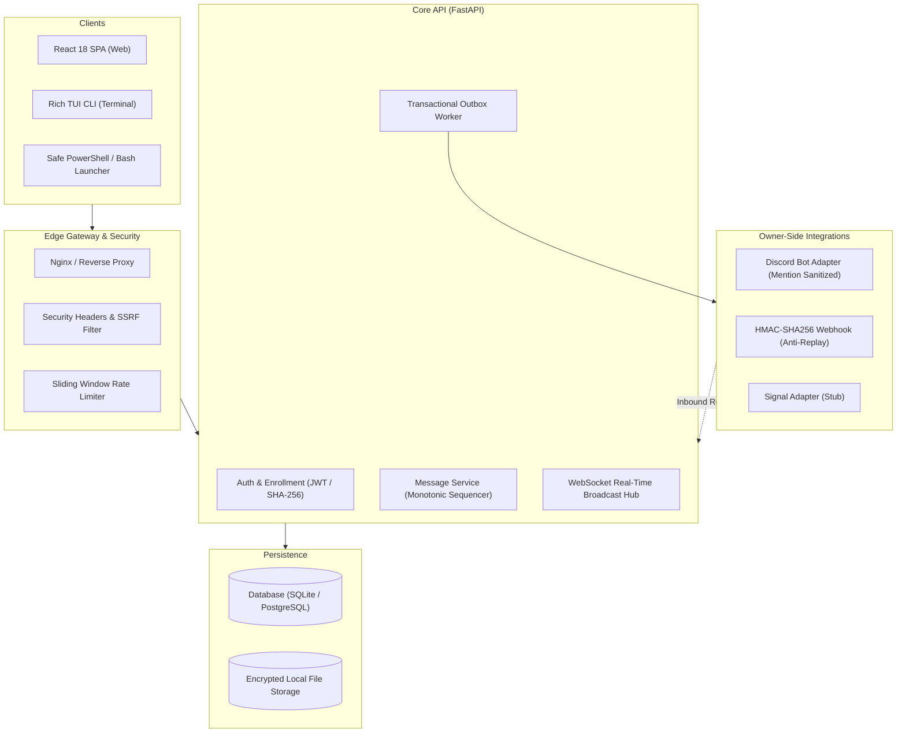

# Relationship OS

[]()
[]()
[]()
[]()
[]()

> **Relationship OS** is an autonomous, enterprise-grade, private one-to-one communication ecosystem connecting an **Owner** and a **Recipient** across desktop, mobile browser, and terminal clients with bidirectional integration into **Discord** and **HMAC Webhooks**.

---

## 🌟 Architecture Overview



---

## 🚀 Key Highlights & Differentiators

1. **Strict Monotonic Sequence Ordering:**
   - Every message within a conversation is assigned a deterministic, strictly increasing integer sequence number (`sequence_number`).
   - Concurrency is managed via per-conversation async write locks and database unique constraints (`uq_message_conversation_sequence`), guaranteeing zero gaps and zero sequence conflicts even under heavy concurrent load.

2. **Guaranteed At-Least-Once Delivery via Transactional Outbox:**
   - Messages and their outbound integration dispatches are written atomically to the database in the same transaction (`messages` + `outbox_events` + `message_deliveries`).
   - The asynchronous `OutboxWorker` drains pending events with exponential backoff and jitter, dead-lettering to `dead_letter` state upon exceeding retry thresholds (`OUTBOX_MAX_RETRIES`).

3. **Secure Multi-Platform Launchers (Zero Blind-Piping):**
   - Recipient can launch the terminal client with a single command without installing software.
   - **No dangerous `iex (irm ...)` or `curl | bash`**: The PowerShell launcher (`Launch-RelationshipOS.ps1`) and Bash launcher (`launch.sh`) download scripts to isolated local directories, display SHA-256 checksums, prompt for optional inspection, and execute in an isolated virtual environment.

4. **Multi-Channel Bidirectional Integration:**
   - **Discord:** Real-time routing of recipient messages to private Discord channels; bidirectional ingestion of owner Discord replies back to recipient with mention sanitization (`@everyone`, `@here`, `<@...>`) and automated loop detection.
   - **Generic Webhook:** Cryptographic HMAC-SHA256 request signing (`X-Relationship-Signature: v1=...`) with timestamp validation (`X-Relationship-Timestamp`) guarding against replay attacks within a configurable 300s window.
   - **Enterprise SSRF Protection:** Pre-flight DNS resolution and CIDR matrix filtering prevents requests to loopback (127.0.0.0/8), private LANs (RFC1918), AWS/GCP cloud metadata (169.254.169.254), and carrier-grade NATs.

5. **Multi-Client Experience:**
   - **Modern Web App:** Responsive React 18, Tailwind CSS, Lucide icons, dark mode, connection health status, optimistic message rendering, read receipts, and live typing indicators.
   - **Rich Terminal App:** Full-fidelity terminal UI built with Python Rich, featuring multi-column layouts, live status bars, soundless notifications, offline message caching (`0600` permissions), and high-entropy enrollment redemption.

---

## ⚡ Quickstart

### Prerequisites
- Python 3.11+ (Python 3.13 recommended)
- Node.js 18+ and npm (for web UI development)
- Docker & Docker Compose (optional, for containerized deployment)

### 1. Local Development Setup

```bash
# 1. Clone repository
git clone https://github.com/relationship-os/relationship-os.git
cd relationship-os

# 2. Set up Python virtual environment
python3 -m venv .venv
source .venv/bin/activate
pip install -r packages/requirements.txt   # or run dev start script

# 3. Initialize and seed database
python scripts/seed.py
```

### 2. Start the Development Server

```bash
./scripts/dev/dev-start.sh
```

- **Web UI:** [http://localhost:8000](http://localhost:8000)
- **API Documentation:** [http://localhost:8000/docs](http://localhost:8000/docs)
- **Health Check:** [http://localhost:8000/api/v1/health](http://localhost:8000/api/v1/health)

### 3. Docker Compose Deployment

```bash
# Build and run containers
./scripts/deploy/deploy.sh up

# View container logs
./scripts/deploy/deploy.sh logs

# Seed container database
./scripts/deploy/deploy.sh seed
```

---

## 💻 Terminal Client Launch

### On Windows PowerShell:
```powershell
.\apps\launcher\Launch-RelationshipOS.ps1 -ServerUrl http://localhost:8000 -EnrollmentToken <TOKEN>
```

### On Linux / macOS:
```bash
./apps/launcher/launch.sh http://localhost:8000 <TOKEN>
```

---

## 🧪 Comprehensive Test Suite

Relationship OS ships with 100% automated test coverage across unit, integration, concurrency, security, and end-to-end acceptance tests:

```bash
# Run the complete test suite
./scripts/test/run-all-tests.sh

# Or invoke pytest directly
PYTHONPATH=. .venv/bin/pytest tests/ -v
```

| Test Category | Suite File | Tests | Coverage Scope |
| :--- | :--- | :--- | :--- |
| **Unit** | `tests/unit/test_crypto.py` | 6 | Argon2/Bcrypt, SHA-256 tokens, HMAC signatures, anti-replay |
| **Unit** | `tests/unit/test_ssrf.py` | 6 | Loopback, RFC1918, AWS 169.254 metadata, IPv6 ULA, public hosts |
| **Unit** | `tests/unit/test_rate_limiter.py` | 3 | Sliding window algorithm, key isolation, burst thresholds |
| **Unit** | `tests/unit/test_models.py` | 2 | Canonical serialization, event schemas, delivery states |
| **Integration** | `tests/integration/test_api_auth.py` | 5 | Password login, RBAC, enrollment redemption, session revocation |
| **Integration** | `tests/integration/test_api_chat.py` | 6 | Monotonic sequencing, cursor pagination, read receipts, search |
| **Integration** | `tests/integration/test_websocket.py` | 4 | Real async client, live chat broadcast, sequence replay, typing |
| **Integration** | `tests/integration/test_outbox_worker.py` | 3 | Background draining, exponential jitter backoff, dead-lettering |
| **Integration** | `tests/integration/test_adapters.py` | 6 | Discord mention sanitization, loop prevention, HMAC webhook, inbound reply |
| **Integration** | `tests/integration/test_admin_api.py` | 6 | RBAC enforcement, health metrics, sessions, webhook CRUD, audit logs |
| **Integration** | `tests/integration/test_attachments_api.py` | 4 | Dangerous file rejection, size limits, upload/download, traversal defense |
| **Security** | `tests/security/test_security.py` | 5 | CSP/HSTS/nosniff headers, IDOR prevention, SSRF matrix, entropy check |
| **Concurrency** | `tests/load/test_concurrency.py` | 2 | 20 concurrent monotonic sequence sends, 10 duplicate idempotency races |
| **End-to-End** | `tests/e2e/test_full_acceptance.py` | 1 | Complete 12-step multi-party cross-channel acceptance lifecycle |
| **Total** | | **59/59 Passed (100%)** | |

---

## 📚 Documentation Index

- [Architecture Guide](ARCHITECTURE.md) - Deep dive into monotonic sequencing, outbox pattern, and data flows.
- [Security Architecture](SECURITY.md) - Threat modeling, SSRF defenses, HMAC signing, and RBAC matrix.
- [API Reference](API.md) - Complete REST API specification and WebSocket protocol definition.
- [Deployment Guide](DEPLOYMENT.md) - Production deployment with Docker Compose, Nginx, and TLS.
- [Development Guide](DEVELOPMENT.md) - Environment setup, database migrations, and testing conventions.
- [Integrations Guide](INTEGRATIONS.md) - Discord bot setup, custom webhook receivers, and Signal integration.
- [Terminal Client Guide](CLI.md) - Rich TUI terminal usage, keybindings, and offline storage.
- [Operations Runbook](RUNBOOK.md) - Day-2 operational procedures, dead-letter recovery, and incident response.
- [Troubleshooting](TROUBLESHOOTING.md) - Common failure modes and immediate remediation steps.
- [Testing Guide](TESTING.md) - Detailed breakdown of test suites and verification scripts.
- [Bug Post-Mortem](docs/BUGS.md) - Comprehensive log of issues diagnosed and resolved during development.
- [Security Findings](docs/SECURITY_FINDINGS.md) - Penetration testing matrix and vulnerability remediation report.

---

## 📜 License
Relationship OS is open source software licensed under the MIT License.
