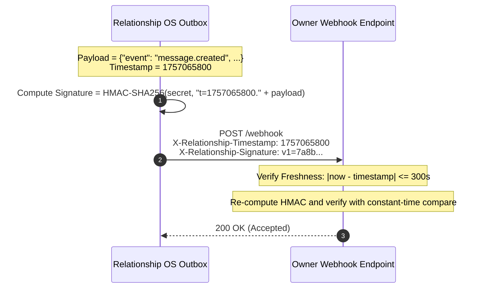

# Relationship OS - Security Architecture & Threat Model

Relationship OS is designed from first principles to guarantee privacy, authenticity, and resilient defense in depth across untrusted public networks and heterogeneous client devices.

---

## 1. Threat Model & Security Principles

| Threat Scenario | Vector | Mitigation in Relationship OS |
| :--- | :--- | :--- |
| **Server-Side Request Forgery (SSRF)** | Malicious webhook destination targeting cloud metadata (e.g. AWS `169.254.169.254`) or internal LAN services. | Comprehensive pre-flight DNS resolution and IP blacklist filtering (`validate_destination_url`). Blocked ranges: loopback, RFC1918, link-local, cloud metadata, ULA. |
| **Webhook Replay Attacks** | Man-in-the-middle intercepting and re-transmitting webhook payloads. | Strict HMAC-SHA256 signature covering payload and timestamp (`X-Relationship-Signature: v1=...`) with an enforced 300s freshness window. |
| **Credential & Token Harvesting** | Database compromise exposing user credentials or active sessions. | Bcrypt password hashing (work factor 12); session tokens and enrollment tokens are hashed with SHA-256 before database insertion. Plaintext tokens are never stored. |
| **Insecure Client Installation** | Blind remote code execution via `curl | bash` or `iex (irm ...)`. | Fully transparent, inspectable launchers (`Launch-RelationshipOS.ps1`, `launch.sh`) that download scripts to sandboxed directories, display SHA-256 checksums, and prompt user confirmation. |
| **IDOR & Unauthorized Access** | Client attempting to read or send messages in unauthorized conversations. | Explicit authorization checks in `MessageService.verify_conversation_access` enforcing participant membership on every message, read receipt, and search call. |
| **Clickjacking & XSS** | Embedded iframe attacks or malicious script execution in the web client. | Strict HTTP security headers: `X-Frame-Options: DENY`, `Content-Security-Policy: default-src 'self'`, `X-Content-Type-Options: nosniff`. |
| **Denial of Service (DoS)** | Unbounded request floods or oversized message payloads. | Sliding-window in-memory rate limiting middleware per client IP and authenticated session; maximum message size enforcement (64 KB for text, 25 MB for attachments). |
| **Container Escape & Privilege Escalation** | Vulnerability in runtime dependencies allowing host compromise. | Docker containers execute under a dedicated unprivileged user (`appuser`, UID 10001) with root privileges stripped. |

---

## 2. Server-Side Request Forgery (SSRF) Defense in Depth

Outbound webhook deliveries represent a critical security boundary. Relationship OS enforces strict pre-flight validation via `packages/shared/src/ssrf.py`:

1. **Protocol Restriction:** Only `http` and `https` schemes are permitted. File, gopher, and internal schemes are rejected.
2. **DNS Resolution & Canonicalization:** The hostname is resolved to all associated IPv4 and IPv6 addresses before opening a network socket.
3. **Blacklisted CIDR Matrix:** Any address matching the following networks is unconditionally blocked:
   - `127.0.0.0/8` (IPv4 Loopback)
   - `::1/128` (IPv6 Loopback)
   - `169.254.0.0/16` (IPv4 Link-Local & AWS/GCP/Azure Cloud Instance Metadata)
   - `fe80::/10` (IPv6 Link-Local)
   - `10.0.0.0/8`, `172.16.0.0/12`, `192.168.0.0/16` (RFC1918 Private Intranets)
   - `100.64.0.0/10` (Carrier-Grade NAT)
   - `fc00::/7` (IPv6 Unique Local Addresses)
   - `0.0.0.0/8`, `224.0.0.0/4`, `240.0.0.0/4`, `255.255.255.255/32` (Reserved/Broadcast)

---

## 3. Cryptographic Request Signing & Anti-Replay Protocol

All outbound and inbound webhooks utilize HMAC-SHA256 request signing:



1. **Signature Header:** `X-Relationship-Signature: v1=<hex_signature>`
2. **Timestamp Header:** `X-Relationship-Timestamp: <unix_seconds>`
3. **Signed String:** `t=<timestamp>.<raw_json_payload>`
4. **Anti-Replay Window:** Receivers must verify $|T_{\text{now}} - T_{\text{header}}| \le 300\text{ seconds}$. Timestamps outside this window are rejected with `401 Unauthorized`.
5. **Constant-Time Verification:** All signature checks use `hmac.compare_digest` to prevent side-channel timing attacks.

---

## 4. Authentication, Session & Token Lifecycle

### 4.1 Password Hashing
- Algorithm: Bcrypt / Argon2id with 12 rounds of salt generation.
- Passwords are never logged or stored in cleartext.

### 4.2 Session Tokens
- Client receives a cryptographically random token (`secrets.token_urlsafe(32)`), offering 256 bits of entropy.
- Database records only `token_hash = sha256(token)`. An adversary with read-only database access cannot impersonate active sessions.
- Sessions maintain metadata: `device_name`, `platform`, `ip_address`, `last_activity_at`.

### 4.3 Enrollment Tokens
- High-entropy tokens for passwordless recipient onboarding.
- Configurable expiration (e.g. 72 hours) and maximum usage limits.
- Stored as SHA-256 hashes in `enrollment_tokens`.

### 4.4 Immediate Revocation
- Users and administrators can revoke sessions individually (`DELETE /api/v1/admin/sessions/{session_id}/revoke`) or bulk-revoke all sessions for a compromised device (`DELETE /api/v1/admin/devices/{device_name}/revoke`).

---

## 5. Client-Side Security & Launcher Hardening

### 5.1 Terminal Client Caching
- Session tokens and message history cached by the Rich CLI are stored in `~/.relationship_os/session.json`.
- Files are created with strict POSIX permissions `0600` (read/write by owner only).

### 5.2 Zero Blind-Piping Guarantee
- **PowerShell Launcher (`Launch-RelationshipOS.ps1`):**
  - Does NOT execute remote strings directly.
  - Downloads the client script to a local AppData directory.
  - Calculates and displays the SHA-256 checksum.
  - Allows the user to inspect code before execution.
- **Shell Launcher (`launch.sh`):**
  - POSIX standard; avoids `curl | bash` piping.
  - Isolates dependencies in a dedicated local virtual environment.

---

## 6. HTTP & Transport Layer Hardening

All responses from Relationship OS include the following defensive headers via `RequestContextAndSecurityHeadersMiddleware`:

```http
Strict-Transport-Security: max-age=31536000; includeSubDomains; preload
X-Content-Type-Options: nosniff
X-Frame-Options: DENY
Referrer-Policy: strict-origin-when-cross-origin
Content-Security-Policy: default-src 'self'; script-src 'self'; style-src 'self' 'unsafe-inline'; img-src 'self' data: blob:; connect-src 'self' ws: wss:; font-src 'self'; frame-ancestors 'none';
Permissions-Policy: camera=(), microphone=(), geolocation=()
X-Request-ID: <uuid4>
```
