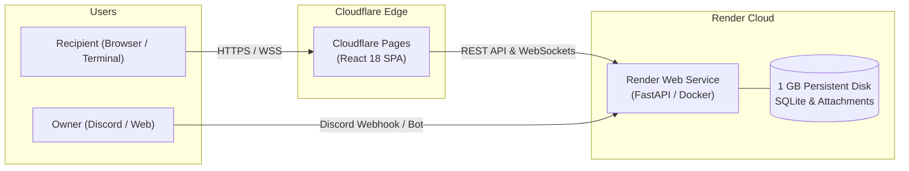

# Cloudflare Pages & Render Deployment Guide (Relationship OS)

This guide provides instructions for deploying the **Frontend on Cloudflare Pages** and the **Backend on Render** from the private repository (`DHIRAJ-GHOLAP/relationship-os-private`).

---

## 1. Architecture Overview



---

## 2. Backend on Render (Web Service)

The repository includes a ready-to-deploy [`render.yaml`](file:///home/flash/relationship-os/render.yaml) blueprint.

### Automatic Blueprint Deployment:
1. Log into your [Render Dashboard](https://dashboard.render.com).
2. Click **New +** $\rightarrow$ **Blueprint**.
3. Connect your private repository: `DHIRAJ-GHOLAP/relationship-os-private`.
4. Render will automatically detect `render.yaml` and configure:
   - **Service Name:** `relationship-os-backend`
   - **Runtime:** `docker` (using `Dockerfile.api`)
   - **Health Check Path:** `/api/v1/health`
   - **Persistent Disk:** 1 GB mounted at `/app/data` (preserves your SQLite messages and users across deploys)
   - **Environment Variables:** Automatically generates a cryptographically secure `SECRET_KEY`.
5. Click **Apply**.
6. Once deployed, Render will assign an HTTPS URL, for example:
   `https://relationship-os-backend.onrender.com`

---

## 3. Frontend on Cloudflare Pages

### Option A: Connect via Cloudflare Dashboard (Recommended)
1. Log into your [Cloudflare Dashboard](https://dash.cloudflare.com) and go to **Compute (Workers & Pages)** $\rightarrow$ **Pages**.
2. Click **Create a project** $\rightarrow$ **Connect to Git**.
3. Select the private repository: `DHIRAJ-GHOLAP/relationship-os-private`.
4. Configure Build Settings:
   - **Framework preset:** `Vite`
   - **Build command:** `npm run build`
   - **Build output directory:** `dist`
   - **Root directory:** `apps/web`
5. In **Environment variables (Advanced)**, add:
   - `NODE_VERSION`: `20`
   - `VITE_API_BASE_URL`: `https://relationship-os-backend.onrender.com` (your Render service URL)
6. Click **Save and Deploy**.

### Option B: Automated Deployment via GitHub Actions
The repository includes `.github/workflows/deploy-cloudflare-pages.yml`.
In your GitHub repository settings under **Secrets and variables $\rightarrow$ Actions**, add:
- `CLOUDFLARE_API_TOKEN`: Cloudflare API token with Pages edit permissions.
- `CLOUDFLARE_ACCOUNT_ID`: Your Cloudflare Account ID.
- `VITE_API_BASE_URL`: `https://relationship-os-backend.onrender.com`.

Every push to `master` will build the frontend and deploy to Cloudflare Pages automatically.

---

## 4. Custom Domain Setup (`vaidu.gholap.xyz`)

To link your custom domain `vaidu.gholap.xyz`:

### Step 1: Connect Frontend (`vaidu.gholap.xyz`) on Cloudflare Pages
1. Go to **Cloudflare Dashboard** $\rightarrow$ **Workers & Pages** $\rightarrow$ select your Pages project.
2. Navigate to the **Custom domains** tab and click **Set up a custom domain**.
3. Type: `vaidu.gholap.xyz`.
4. Click **Continue** $\rightarrow$ **Activate domain**.
   * Since your zone `gholap.xyz` is hosted on Cloudflare, DNS records and SSL are configured automatically with zero downtime.

### Step 2: Connect Backend API (`api.vaidu.gholap.xyz`) on Render
1. Go to **Render Dashboard** $\rightarrow$ select `relationship-os-backend`.
2. Click **Settings** $\rightarrow$ scroll down to **Custom Domains** $\rightarrow$ click **Add Custom Domain**.
3. Type: `api.vaidu.gholap.xyz`.
4. In your Cloudflare DNS table for `gholap.xyz`, add a CNAME record:
   * **Type:** `CNAME`
   * **Name:** `api.vaidu`
   * **Target:** Your Render service URL (e.g., `relationship-os-backend.onrender.com`)
   * **Proxy status:** DNS Only (gray cloud) initially while Render issues certificate, or Proxied (orange cloud) with SSL set to Full (strict).

### Step 3: Set Frontend Environment Variable
In your Cloudflare Pages project $\rightarrow$ **Settings** $\rightarrow$ **Environment variables**:
* Set `VITE_API_BASE_URL` to `https://api.vaidu.gholap.xyz`.

---

## 5. CORS & WebSockets Verification

Render's backend service allows connections from your domain via:
```yaml
- key: ALLOWED_ORIGINS
  value: "https://vaidu.gholap.xyz,https://*.gholap.xyz,https://*.pages.dev,https://*.render.com,http://localhost:3000,http://localhost:8000"
```
Both REST API requests and WebSocket subscriptions (`wss://api.vaidu.gholap.xyz/api/v1/ws?token=...`) will connect securely across origins.

